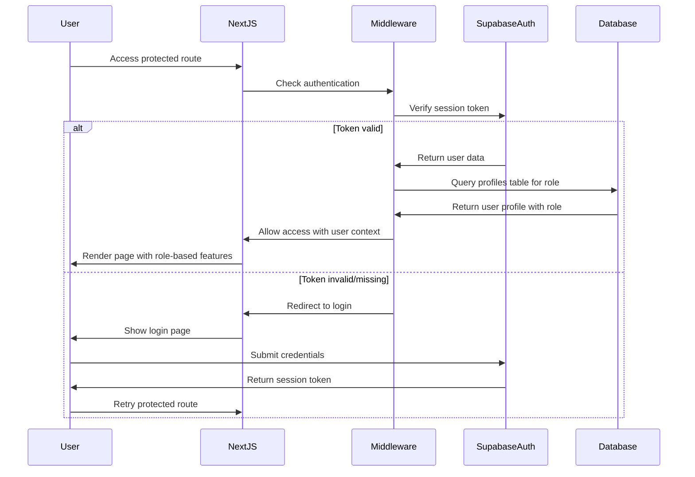
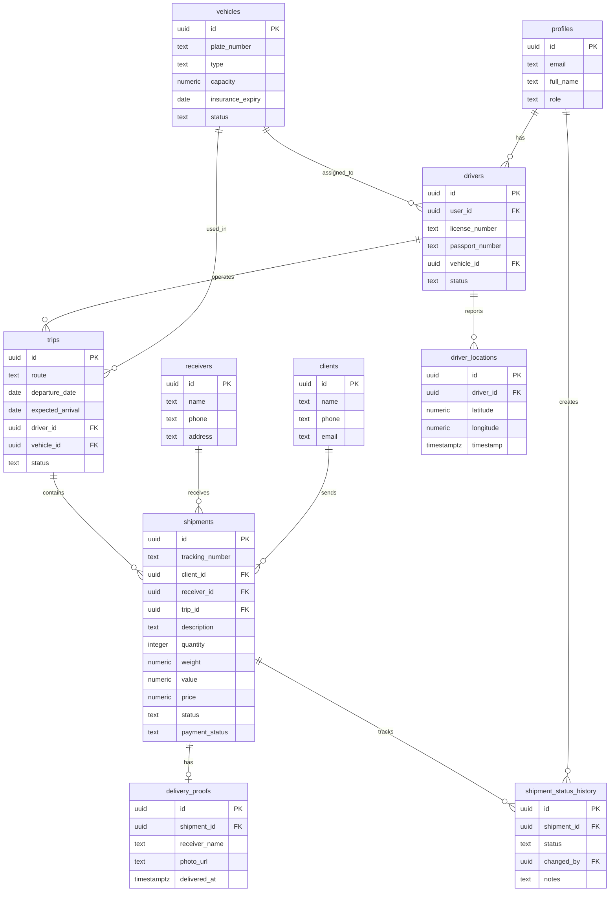

# Design Document: Logistics CRM Application

## Overview

This document provides the technical design for a fullstack logistics CRM application built with Next.js 14 (App Router), Supabase, and TypeScript. The system manages the complete lifecycle of cargo transportation between Johannesburg (South Africa) and cities in the Democratic Republic of Congo (Lubumbashi and Kinshasa).

### Core Capabilities

- Multi-role authentication (Admin, Operator, Driver) with Supabase Auth
- Client and receiver management with comprehensive contact information
- Shipment tracking with unique tracking numbers and status workflows
- Trip planning and management with driver and vehicle assignments
- Real-time driver location tracking with map visualization
- Mobile-responsive driver interface for on-the-go updates
- Delivery proof capture with photo uploads
- Revenue and payment tracking
- Dashboard analytics with key business metrics

### Technology Stack

- **Frontend**: Next.js 14 (App Router), React 18, TypeScript
- **UI Components**: ShadCN UI, TailwindCSS
- **Backend**: Next.js Server Actions, Supabase PostgreSQL
- **Authentication**: Supabase Auth
- **Storage**: Supabase Storage
- **Maps**: Leaflet with React-Leaflet
- **Validation**: Zod
- **Image Processing**: Sharp (for compression)

## Architecture

### System Architecture

The application follows a modern fullstack architecture leveraging Next.js App Router for both client and server-side rendering:

```
┌─────────────────────────────────────────────────────────────┐
│                     Client Browser                          │
│  ┌──────────────────────────────────────────────────────┐  │
│  │  Next.js App Router (React Components)              │  │
│  │  - Server Components (default)                       │  │
│  │  - Client Components (interactive UI)               │  │
│  │  - ShadCN UI + TailwindCSS                          │  │
│  └──────────────────────────────────────────────────────┘  │
└─────────────────────────────────────────────────────────────┘
                            │
                            │ HTTPS
                            ▼
┌─────────────────────────────────────────────────────────────┐
│                   Next.js Server                            │
│  ┌──────────────────────────────────────────────────────┐  │
│  │  App Router Pages & Layouts                          │  │
│  │  - Server-side rendering                             │  │
│  │  - Middleware (auth checks)                          │  │
│  └──────────────────────────────────────────────────────┘  │
│  ┌──────────────────────────────────────────────────────┐  │
│  │  Server Actions                                      │  │
│  │  - Form submissions                                  │  │
│  │  - Data mutations                                    │  │
│  │  - File uploads                                      │  │
│  └──────────────────────────────────────────────────────┘  │
│  ┌──────────────────────────────────────────────────────┐  │
│  │  API Routes (optional)                               │  │
│  │  - Webhooks                                          │  │
│  │  - Third-party integrations                          │  │
│  └──────────────────────────────────────────────────────┘  │
└─────────────────────────────────────────────────────────────┘
                            │
                            │ Supabase Client
                            ▼
┌─────────────────────────────────────────────────────────────┐
│                    Supabase Backend                         │
│  ┌──────────────────────────────────────────────────────┐  │
│  │  Supabase Auth                                       │  │
│  │  - User authentication                               │  │
│  │  - Session management                                │  │
│  │  - JWT tokens                                        │  │
│  └──────────────────────────────────────────────────────┘  │
│  ┌──────────────────────────────────────────────────────┐  │
│  │  PostgreSQL Database                                 │  │
│  │  - Row Level Security (RLS)                          │  │
│  │  - Foreign key constraints                           │  │
│  │  - Indexes                                           │  │
│  └──────────────────────────────────────────────────────┘  │
│  ┌──────────────────────────────────────────────────────┐  │
│  │  Supabase Storage                                    │  │
│  │  - Delivery photos                                   │  │
│  │  - File organization by shipment                     │  │
│  └──────────────────────────────────────────────────────┘  │
└─────────────────────────────────────────────────────────────┘
```

### Authentication Flow



### Data Flow Patterns

**Server Component Pattern (Read Operations)**:
```typescript
// app/shipments/page.tsx
async function ShipmentsPage() {
  const supabase = createServerClient()
  const { data: shipments } = await supabase
    .from('shipments')
    .select('*, clients(*), receivers(*), trips(*)')
  
  return <ShipmentsTable shipments={shipments} />
}
```

**Server Action Pattern (Write Operations)**:
```typescript
// app/actions/shipments.ts
'use server'
export async function createShipment(formData: FormData) {
  const supabase = createServerClient()
  const validated = shipmentSchema.parse(formData)
  
  const { data, error } = await supabase
    .from('shipments')
    .insert(validated)
    .select()
  
  revalidatePath('/shipments')
  return { data, error }
}
```

**Client Component Pattern (Interactive UI)**:
```typescript
// components/shipment-form.tsx
'use client'
export function ShipmentForm() {
  const [pending, startTransition] = useTransition()
  
  const handleSubmit = (formData: FormData) => {
    startTransition(async () => {
      await createShipment(formData)
    })
  }
  
  return <form action={handleSubmit}>...</form>
}
```

## Components and Interfaces

### Application Structure

```
app/
├── (auth)/
│   ├── login/
│   │   └── page.tsx                 # Login page
│   └── layout.tsx                   # Auth layout (no sidebar)
├── (dashboard)/
│   ├── layout.tsx                   # Main layout with sidebar
│   ├── page.tsx                     # Dashboard with analytics
│   ├── clients/
│   │   ├── page.tsx                 # Client list
│   │   ├── [id]/
│   │   │   └── page.tsx             # Client detail with shipment history
│   │   └── new/
│   │       └── page.tsx             # Create client form
│   ├── shipments/
│   │   ├── page.tsx                 # Shipment list with search
│   │   ├── [id]/
│   │   │   └── page.tsx             # Shipment detail with timeline
│   │   └── new/
│   │       └── page.tsx             # Create shipment form
│   ├── trips/
│   │   ├── page.tsx                 # Trip list
│   │   ├── [id]/
│   │   │   └── page.tsx             # Trip detail
│   │   └── new/
│   │       └── page.tsx             # Create trip form
│   ├── drivers/
│   │   ├── page.tsx                 # Driver list (Admin only)
│   │   ├── [id]/
│   │   │   └── page.tsx             # Driver detail with trip history
│   │   └── new/
│   │       └── page.tsx             # Create driver form
│   ├── vehicles/
│   │   ├── page.tsx                 # Vehicle list (Admin only)
│   │   ├── [id]/
│   │   │   └── page.tsx             # Vehicle detail
│   │   └── new/
│   │       └── page.tsx             # Create vehicle form
│   ├── map/
│   │   └── page.tsx                 # Driver location map
│   └── driver-portal/
│       ├── page.tsx                 # Driver dashboard (mobile-optimized)
│       └── deliveries/
│           └── [id]/
│               └── page.tsx         # Delivery confirmation with photo upload
├── actions/
│   ├── auth.ts                      # Authentication actions
│   ├── clients.ts                   # Client CRUD actions
│   ├── shipments.ts                 # Shipment CRUD actions
│   ├── trips.ts                     # Trip CRUD actions
│   ├── drivers.ts                   # Driver CRUD actions
│   ├── vehicles.ts                  # Vehicle CRUD actions
│   ├── locations.ts                 # Driver location actions
│   └── deliveries.ts                # Delivery proof actions
├── api/
│   └── webhooks/
│       └── route.ts                 # Webhook handlers (if needed)
└── middleware.ts                    # Auth middleware

components/
├── ui/                              # ShadCN UI components
│   ├── button.tsx
│   ├── input.tsx
│   ├── table.tsx
│   ├── dialog.tsx
│   ├── select.tsx
│   ├── card.tsx
│   └── ...
├── layout/
│   ├── sidebar.tsx                  # Navigation sidebar
│   ├── header.tsx                   # Page header
│   └── mobile-nav.tsx               # Mobile hamburger menu
├── dashboard/
│   ├── metric-card.tsx              # Dashboard metric display
│   └── revenue-chart.tsx            # Revenue visualization
├── clients/
│   ├── client-form.tsx              # Client create/edit form
│   ├── client-table.tsx             # Client list table
│   └── client-search.tsx            # Client search component
├── shipments/
│   ├── shipment-form.tsx            # Shipment create/edit form
│   ├── shipment-table.tsx           # Shipment list table
│   ├── shipment-search.tsx          # Shipment search by tracking number
│   ├── shipment-timeline.tsx        # Status change timeline
│   └── status-badge.tsx             # Status visual indicator
├── trips/
│   ├── trip-form.tsx                # Trip create/edit form
│   ├── trip-table.tsx               # Trip list table
│   └── trip-status-badge.tsx        # Trip status indicator
├── drivers/
│   ├── driver-form.tsx              # Driver create/edit form
│   ├── driver-table.tsx             # Driver list table
│   └── location-button.tsx          # Location update button
├── vehicles/
│   ├── vehicle-form.tsx             # Vehicle create/edit form
│   ├── vehicle-table.tsx            # Vehicle list table
│   └── insurance-warning.tsx        # Insurance expiry warning
├── map/
│   ├── driver-map.tsx               # Leaflet map component
│   └── driver-marker.tsx            # Custom marker with popup
├── delivery/
│   ├── photo-upload.tsx             # Photo upload component
│   └── delivery-form.tsx            # Delivery confirmation form
└── shared/
    ├── data-table.tsx               # Reusable table with sorting/filtering
    ├── search-input.tsx             # Debounced search input
    ├── loading-spinner.tsx          # Loading state indicator
    └── error-message.tsx            # Error display component

lib/
├── supabase/
│   ├── client.ts                    # Browser Supabase client
│   ├── server.ts                    # Server Supabase client
│   └── middleware.ts                # Middleware Supabase client
├── validations/
│   ├── client.ts                    # Client validation schemas
│   ├── shipment.ts                  # Shipment validation schemas
│   ├── trip.ts                      # Trip validation schemas
│   ├── driver.ts                    # Driver validation schemas
│   └── vehicle.ts                   # Vehicle validation schemas
├── utils/
│   ├── format.ts                    # Formatting utilities
│   ├── date.ts                      # Date utilities
│   └── image.ts                     # Image compression utilities
└── types/
    └── database.ts                  # TypeScript types from Supabase
```

### Key Component Interfaces

**Sidebar Navigation Component**:
```typescript
interface SidebarProps {
  userRole: 'admin' | 'operator' | 'driver'
}

// Renders role-based navigation items
// Admin: All sections
// Operator: Dashboard, Clients, Shipments, Trips, Map
// Driver: Driver Portal only
```

**Data Table Component**:
```typescript
interface DataTableProps<T> {
  data: T[]
  columns: ColumnDef<T>[]
  searchKey?: string
  filterOptions?: FilterOption[]
  onRowClick?: (row: T) => void
}

// Provides sorting, filtering, pagination
// Used across all list views
```

**Shipment Timeline Component**:
```typescript
interface TimelineEvent {
  id: string
  timestamp: Date
  status: ShipmentStatus
  user: string
  description: string
}

interface ShipmentTimelineProps {
  events: TimelineEvent[]
}

// Displays chronological status changes
// Visual indicators for each status type
```

**Driver Map Component**:
```typescript
interface DriverLocation {
  driver_id: string
  driver_name: string
  latitude: number
  longitude: number
  timestamp: Date
}

interface DriverMapProps {
  locations: DriverLocation[]
  refreshInterval?: number // default 60000ms
}

// Leaflet map centered on Johannesburg-DRC region
// Auto-refresh every 60 seconds
// Clickable markers with driver info popup
```

**Photo Upload Component**:
```typescript
interface PhotoUploadProps {
  shipmentId: string
  onUploadComplete: (url: string) => void
  maxSizeMB?: number // default 10
  compressThreshold?: number // default 2MB
}

// Validates image format (jpg, png, webp)
// Compresses images > 2MB using Sharp
// Uploads to Supabase Storage
// Retries up to 3 times on failure
```

## Data Models

### Database Schema

The database uses PostgreSQL with Supabase, implementing UUID primary keys, foreign key constraints, and appropriate indexes.

#### Profiles Table
```sql
CREATE TABLE profiles (
  id UUID PRIMARY KEY REFERENCES auth.users(id) ON DELETE CASCADE,
  email TEXT NOT NULL UNIQUE,
  full_name TEXT NOT NULL,
  role TEXT NOT NULL CHECK (role IN ('admin', 'operator', 'driver')),
  created_at TIMESTAMPTZ NOT NULL DEFAULT NOW(),
  updated_at TIMESTAMPTZ NOT NULL DEFAULT NOW()
);

CREATE INDEX idx_profiles_role ON profiles(role);
CREATE INDEX idx_profiles_email ON profiles(email);
```

#### Clients Table
```sql
CREATE TABLE clients (
  id UUID PRIMARY KEY DEFAULT gen_random_uuid(),
  name TEXT NOT NULL,
  phone TEXT NOT NULL,
  whatsapp TEXT,
  email TEXT,
  address TEXT,
  city TEXT,
  country TEXT,
  notes TEXT,
  created_at TIMESTAMPTZ NOT NULL DEFAULT NOW(),
  updated_at TIMESTAMPTZ NOT NULL DEFAULT NOW(),
  
  CONSTRAINT email_format CHECK (email ~* '^[A-Za-z0-9._%+-]+@[A-Za-z0-9.-]+\.[A-Z|a-z]{2,}$' OR email IS NULL)
);

CREATE INDEX idx_clients_name ON clients(name);
CREATE INDEX idx_clients_phone ON clients(phone);
CREATE INDEX idx_clients_email ON clients(email);
```

#### Receivers Table
```sql
CREATE TABLE receivers (
  id UUID PRIMARY KEY DEFAULT gen_random_uuid(),
  name TEXT NOT NULL,
  phone TEXT NOT NULL,
  address TEXT NOT NULL,
  city TEXT NOT NULL,
  country TEXT NOT NULL,
  created_at TIMESTAMPTZ NOT NULL DEFAULT NOW(),
  updated_at TIMESTAMPTZ NOT NULL DEFAULT NOW()
);

CREATE INDEX idx_receivers_phone ON receivers(phone);
```

#### Vehicles Table
```sql
CREATE TABLE vehicles (
  id UUID PRIMARY KEY DEFAULT gen_random_uuid(),
  plate_number TEXT NOT NULL UNIQUE,
  type TEXT NOT NULL,
  capacity NUMERIC NOT NULL,
  insurance_expiry DATE NOT NULL,
  status TEXT NOT NULL DEFAULT 'available' CHECK (status IN ('available', 'in_use', 'maintenance', 'retired')),
  created_at TIMESTAMPTZ NOT NULL DEFAULT NOW(),
  updated_at TIMESTAMPTZ NOT NULL DEFAULT NOW()
);

CREATE INDEX idx_vehicles_plate_number ON vehicles(plate_number);
CREATE INDEX idx_vehicles_status ON vehicles(status);
CREATE INDEX idx_vehicles_insurance_expiry ON vehicles(insurance_expiry);
```

#### Drivers Table
```sql
CREATE TABLE drivers (
  id UUID PRIMARY KEY DEFAULT gen_random_uuid(),
  user_id UUID NOT NULL REFERENCES profiles(id) ON DELETE CASCADE,
  license_number TEXT NOT NULL UNIQUE,
  passport_number TEXT NOT NULL UNIQUE,
  vehicle_id UUID REFERENCES vehicles(id) ON DELETE SET NULL,
  status TEXT NOT NULL DEFAULT 'active' CHECK (status IN ('active', 'inactive', 'on_leave')),
  created_at TIMESTAMPTZ NOT NULL DEFAULT NOW(),
  updated_at TIMESTAMPTZ NOT NULL DEFAULT NOW()
);

CREATE INDEX idx_drivers_user_id ON drivers(user_id);
CREATE INDEX idx_drivers_license_number ON drivers(license_number);
CREATE INDEX idx_drivers_status ON drivers(status);
```

#### Trips Table
```sql
CREATE TABLE trips (
  id UUID PRIMARY KEY DEFAULT gen_random_uuid(),
  route TEXT NOT NULL,
  departure_date DATE NOT NULL,
  expected_arrival DATE NOT NULL,
  driver_id UUID REFERENCES drivers(id) ON DELETE SET NULL,
  vehicle_id UUID REFERENCES vehicles(id) ON DELETE SET NULL,
  status TEXT NOT NULL DEFAULT 'planned' CHECK (status IN ('planned', 'in_progress', 'completed', 'cancelled')),
  created_at TIMESTAMPTZ NOT NULL DEFAULT NOW(),
  updated_at TIMESTAMPTZ NOT NULL DEFAULT NOW(),
  
  CONSTRAINT valid_dates CHECK (expected_arrival >= departure_date)
);

CREATE INDEX idx_trips_driver_id ON trips(driver_id);
CREATE INDEX idx_trips_vehicle_id ON trips(vehicle_id);
CREATE INDEX idx_trips_status ON trips(status);
CREATE INDEX idx_trips_departure_date ON trips(departure_date);
```

#### Shipments Table
```sql
CREATE TABLE shipments (
  id UUID PRIMARY KEY DEFAULT gen_random_uuid(),
  tracking_number TEXT NOT NULL UNIQUE,
  client_id UUID NOT NULL REFERENCES clients(id) ON DELETE RESTRICT,
  receiver_id UUID NOT NULL REFERENCES receivers(id) ON DELETE RESTRICT,
  trip_id UUID REFERENCES trips(id) ON DELETE SET NULL,
  description TEXT NOT NULL,
  quantity INTEGER NOT NULL,
  weight NUMERIC NOT NULL,
  value NUMERIC NOT NULL,
  price NUMERIC NOT NULL,
  status TEXT NOT NULL DEFAULT 'pending' CHECK (status IN ('pending', 'in_transit', 'delivered', 'cancelled')),
  payment_status TEXT NOT NULL DEFAULT 'unpaid' CHECK (payment_status IN ('unpaid', 'partial', 'paid')),
  created_at TIMESTAMPTZ NOT NULL DEFAULT NOW(),
  updated_at TIMESTAMPTZ NOT NULL DEFAULT NOW(),
  
  CONSTRAINT positive_quantity CHECK (quantity > 0),
  CONSTRAINT positive_weight CHECK (weight > 0),
  CONSTRAINT positive_value CHECK (value >= 0),
  CONSTRAINT positive_price CHECK (price >= 0)
);

CREATE UNIQUE INDEX idx_shipments_tracking_number ON shipments(tracking_number);
CREATE INDEX idx_shipments_client_id ON shipments(client_id);
CREATE INDEX idx_shipments_receiver_id ON shipments(receiver_id);
CREATE INDEX idx_shipments_trip_id ON shipments(trip_id);
CREATE INDEX idx_shipments_status ON shipments(status);
CREATE INDEX idx_shipments_payment_status ON shipments(payment_status);
```

#### Driver Locations Table
```sql
CREATE TABLE driver_locations (
  id UUID PRIMARY KEY DEFAULT gen_random_uuid(),
  driver_id UUID NOT NULL REFERENCES drivers(id) ON DELETE CASCADE,
  latitude NUMERIC NOT NULL,
  longitude NUMERIC NOT NULL,
  timestamp TIMESTAMPTZ NOT NULL DEFAULT NOW(),
  created_at TIMESTAMPTZ NOT NULL DEFAULT NOW(),
  
  CONSTRAINT valid_latitude CHECK (latitude >= -90 AND latitude <= 90),
  CONSTRAINT valid_longitude CHECK (longitude >= -180 AND longitude <= 180)
);

CREATE INDEX idx_driver_locations_driver_id ON driver_locations(driver_id);
CREATE INDEX idx_driver_locations_timestamp ON driver_locations(timestamp DESC);
```

#### Delivery Proofs Table
```sql
CREATE TABLE delivery_proofs (
  id UUID PRIMARY KEY DEFAULT gen_random_uuid(),
  shipment_id UUID NOT NULL REFERENCES shipments(id) ON DELETE CASCADE,
  receiver_name TEXT NOT NULL,
  photo_url TEXT NOT NULL,
  delivered_at TIMESTAMPTZ NOT NULL DEFAULT NOW(),
  created_at TIMESTAMPTZ NOT NULL DEFAULT NOW()
);

CREATE INDEX idx_delivery_proofs_shipment_id ON delivery_proofs(shipment_id);
```

#### Shipment Status History Table (for timeline)
```sql
CREATE TABLE shipment_status_history (
  id UUID PRIMARY KEY DEFAULT gen_random_uuid(),
  shipment_id UUID NOT NULL REFERENCES shipments(id) ON DELETE CASCADE,
  status TEXT NOT NULL,
  changed_by UUID NOT NULL REFERENCES profiles(id),
  notes TEXT,
  created_at TIMESTAMPTZ NOT NULL DEFAULT NOW()
);

CREATE INDEX idx_shipment_status_history_shipment_id ON shipment_status_history(shipment_id);
CREATE INDEX idx_shipment_status_history_created_at ON shipment_status_history(created_at DESC);
```

### Entity Relationships



### TypeScript Type Definitions

```typescript
// Generated from Supabase schema
export type UserRole = 'admin' | 'operator' | 'driver'

export type ShipmentStatus = 'pending' | 'in_transit' | 'delivered' | 'cancelled'
export type PaymentStatus = 'unpaid' | 'partial' | 'paid'
export type TripStatus = 'planned' | 'in_progress' | 'completed' | 'cancelled'
export type VehicleStatus = 'available' | 'in_use' | 'maintenance' | 'retired'
export type DriverStatus = 'active' | 'inactive' | 'on_leave'

export interface Profile {
  id: string
  email: string
  full_name: string
  role: UserRole
  created_at: string
  updated_at: string
}

export interface Client {
  id: string
  name: string
  phone: string
  whatsapp?: string
  email?: string
  address?: string
  city?: string
  country?: string
  notes?: string
  created_at: string
  updated_at: string
}

export interface Receiver {
  id: string
  name: string
  phone: string
  address: string
  city: string
  country: string
  created_at: string
  updated_at: string
}

export interface Vehicle {
  id: string
  plate_number: string
  type: string
  capacity: number
  insurance_expiry: string
  status: VehicleStatus
  created_at: string
  updated_at: string
}

export interface Driver {
  id: string
  user_id: string
  license_number: string
  passport_number: string
  vehicle_id?: string
  status: DriverStatus
  created_at: string
  updated_at: string
  profile?: Profile
  vehicle?: Vehicle
}

export interface Trip {
  id: string
  route: string
  departure_date: string
  expected_arrival: string
  driver_id?: string
  vehicle_id?: string
  status: TripStatus
  created_at: string
  updated_at: string
  driver?: Driver
  vehicle?: Vehicle
  shipments?: Shipment[]
}

export interface Shipment {
  id: string
  tracking_number: string
  client_id: string
  receiver_id: string
  trip_id?: string
  description: string
  quantity: number
  weight: number
  value: number
  price: number
  status: ShipmentStatus
  payment_status: PaymentStatus
  created_at: string
  updated_at: string
  client?: Client
  receiver?: Receiver
  trip?: Trip
  delivery_proof?: DeliveryProof
}

export interface DriverLocation {
  id: string
  driver_id: string
  latitude: number
  longitude: number
  timestamp: string
  created_at: string
}

export interface DeliveryProof {
  id: string
  shipment_id: string
  receiver_name: string
  photo_url: string
  delivered_at: string
  created_at: string
}

export interface ShipmentStatusHistory {
  id: string
  shipment_id: string
  status: ShipmentStatus
  changed_by: string
  notes?: string
  created_at: string
  profile?: Profile
}
```

### Validation Schemas

Using Zod for runtime validation:

```typescript
// lib/validations/client.ts
export const clientSchema = z.object({
  name: z.string().min(1, 'Name is required'),
  phone: z.string().regex(/^[0-9+\-\s()]+$/, 'Invalid phone format'),
  whatsapp: z.string().regex(/^[0-9+\-\s()]+$/).optional(),
  email: z.string().email('Invalid email format').optional().or(z.literal('')),
  address: z.string().optional(),
  city: z.string().optional(),
  country: z.string().optional(),
  notes: z.string().optional(),
})

// lib/validations/shipment.ts
export const shipmentSchema = z.object({
  client_id: z.string().uuid('Invalid client'),
  receiver_id: z.string().uuid('Invalid receiver'),
  trip_id: z.string().uuid().optional(),
  description: z.string().min(1, 'Description is required'),
  quantity: z.number().int().positive('Quantity must be positive'),
  weight: z.number().positive('Weight must be positive'),
  value: z.number().nonnegative('Value cannot be negative'),
  price: z.number().nonnegative('Price cannot be negative'),
})

// lib/validations/trip.ts
export const tripSchema = z.object({
  route: z.string().min(1, 'Route is required'),
  departure_date: z.string().refine((date) => !isNaN(Date.parse(date)), 'Invalid date'),
  expected_arrival: z.string().refine((date) => !isNaN(Date.parse(date)), 'Invalid date'),
  driver_id: z.string().uuid('Invalid driver').optional(),
  vehicle_id: z.string().uuid('Invalid vehicle').optional(),
}).refine((data) => {
  const departure = new Date(data.departure_date)
  const arrival = new Date(data.expected_arrival)
  return arrival >= departure
}, {
  message: 'Expected arrival must be after departure date',
  path: ['expected_arrival'],
})

// lib/validations/driver.ts
export const driverSchema = z.object({
  user_id: z.string().uuid('Invalid user'),
  license_number: z.string().min(1, 'License number is required'),
  passport_number: z.string().min(1, 'Passport number is required'),
  vehicle_id: z.string().uuid().optional(),
})

// lib/validations/vehicle.ts
export const vehicleSchema = z.object({
  plate_number: z.string().min(1, 'Plate number is required'),
  type: z.string().min(1, 'Vehicle type is required'),
  capacity: z.number().positive('Capacity must be positive'),
  insurance_expiry: z.string().refine((date) => !isNaN(Date.parse(date)), 'Invalid date'),
})
```


## Authentication and Authorization

### Supabase Auth Integration

The application uses Supabase Auth for user authentication with email/password. User roles are stored in the `profiles` table and checked via middleware.

**Middleware Implementation** (`middleware.ts`):
```typescript
import { createMiddlewareClient } from '@supabase/auth-helpers-nextjs'
import { NextResponse } from 'next/server'
import type { NextRequest } from 'next/server'

export async function middleware(req: NextRequest) {
  const res = NextResponse.next()
  const supabase = createMiddlewareClient({ req, res })

  const {
    data: { session },
  } = await supabase.auth.getSession()

  // Redirect to login if not authenticated
  if (!session && !req.nextUrl.pathname.startsWith('/login')) {
    return NextResponse.redirect(new URL('/login', req.url))
  }

  // Redirect to dashboard if authenticated and on login page
  if (session && req.nextUrl.pathname.startsWith('/login')) {
    return NextResponse.redirect(new URL('/', req.url))
  }

  // Role-based access control
  if (session) {
    const { data: profile } = await supabase
      .from('profiles')
      .select('role')
      .eq('id', session.user.id)
      .single()

    const role = profile?.role

    // Admin-only routes
    if (
      (req.nextUrl.pathname.startsWith('/drivers') ||
        req.nextUrl.pathname.startsWith('/vehicles')) &&
      role !== 'admin'
    ) {
      return NextResponse.redirect(new URL('/', req.url))
    }

    // Driver-only routes
    if (
      req.nextUrl.pathname.startsWith('/driver-portal') &&
      role !== 'driver'
    ) {
      return NextResponse.redirect(new URL('/', req.url))
    }

    // Operator and Admin routes (exclude drivers)
    if (
      (req.nextUrl.pathname.startsWith('/clients') ||
        req.nextUrl.pathname.startsWith('/shipments') ||
        req.nextUrl.pathname.startsWith('/trips') ||
        req.nextUrl.pathname.startsWith('/map')) &&
      role === 'driver'
    ) {
      return NextResponse.redirect(new URL('/driver-portal', req.url))
    }
  }

  return res
}

export const config = {
  matcher: ['/((?!_next/static|_next/image|favicon.ico|public).*)'],
}
```

### Role-Based Access Matrix

| Feature | Admin | Operator | Driver |
|---------|-------|----------|--------|
| Dashboard Analytics | ✓ | ✓ | ✗ |
| Client Management | ✓ | ✓ | ✗ |
| Shipment Management | ✓ | ✓ | ✗ |
| Trip Management | ✓ | ✓ | ✗ |
| Driver Management | ✓ | ✗ | ✗ |
| Vehicle Management | ✓ | ✗ | ✗ |
| Map View | ✓ | ✓ | ✗ |
| Driver Portal | ✗ | ✗ | ✓ |
| Update Shipment Status | ✓ | ✓ | ✓ (own trips) |
| Upload Delivery Proof | ✗ | ✗ | ✓ |
| Update Location | ✗ | ✗ | ✓ |

### Session Management

- Sessions are managed by Supabase Auth with JWT tokens
- Tokens are stored in HTTP-only cookies
- Session refresh is handled automatically by Supabase client
- Session state is maintained across page navigation using Next.js middleware

## Server Actions

Server Actions provide type-safe, server-side mutations with automatic revalidation.

### Shipment Actions

```typescript
// app/actions/shipments.ts
'use server'

import { createServerClient } from '@/lib/supabase/server'
import { shipmentSchema } from '@/lib/validations/shipment'
import { revalidatePath } from 'next/cache'
import { nanoid } from 'nanoid'

export async function createShipment(formData: FormData) {
  const supabase = createServerClient()

  // Validate input
  const validated = shipmentSchema.parse({
    client_id: formData.get('client_id'),
    receiver_id: formData.get('receiver_id'),
    trip_id: formData.get('trip_id') || undefined,
    description: formData.get('description'),
    quantity: Number(formData.get('quantity')),
    weight: Number(formData.get('weight')),
    value: Number(formData.get('value')),
    price: Number(formData.get('price')),
  })

  // Generate unique tracking number
  const tracking_number = `TRK-${nanoid(10).toUpperCase()}`

  // Insert shipment
  const { data, error } = await supabase
    .from('shipments')
    .insert({
      ...validated,
      tracking_number,
      status: 'pending',
      payment_status: 'unpaid',
    })
    .select()
    .single()

  if (error) {
    return { error: error.message }
  }

  // Create initial status history entry
  const { data: { user } } = await supabase.auth.getUser()
  await supabase.from('shipment_status_history').insert({
    shipment_id: data.id,
    status: 'pending',
    changed_by: user!.id,
    notes: 'Shipment created',
  })

  revalidatePath('/shipments')
  return { data }
}

export async function updateShipmentStatus(
  shipmentId: string,
  status: ShipmentStatus,
  notes?: string
) {
  const supabase = createServerClient()

  // Update shipment status
  const { error } = await supabase
    .from('shipments')
    .update({ status, updated_at: new Date().toISOString() })
    .eq('id', shipmentId)

  if (error) {
    return { error: error.message }
  }

  // Record status change in history
  const { data: { user } } = await supabase.auth.getUser()
  await supabase.from('shipment_status_history').insert({
    shipment_id: shipmentId,
    status,
    changed_by: user!.id,
    notes,
  })

  revalidatePath('/shipments')
  revalidatePath(`/shipments/${shipmentId}`)
  return { success: true }
}

export async function searchShipments(query: string) {
  const supabase = createServerClient()

  const { data, error } = await supabase
    .from('shipments')
    .select('*, clients(*), receivers(*), trips(*)')
    .or(`tracking_number.ilike.%${query}%`)
    .order('created_at', { ascending: false })
    .limit(20)

  if (error) {
    return { error: error.message }
  }

  return { data }
}
```

### Trip Actions

```typescript
// app/actions/trips.ts
'use server'

import { createServerClient } from '@/lib/supabase/server'
import { tripSchema } from '@/lib/validations/trip'
import { revalidatePath } from 'next/cache'

export async function createTrip(formData: FormData) {
  const supabase = createServerClient()

  const validated = tripSchema.parse({
    route: formData.get('route'),
    departure_date: formData.get('departure_date'),
    expected_arrival: formData.get('expected_arrival'),
    driver_id: formData.get('driver_id') || undefined,
    vehicle_id: formData.get('vehicle_id') || undefined,
  })

  // Check for overlapping driver assignments
  if (validated.driver_id) {
    const { data: overlapping } = await supabase
      .from('trips')
      .select('id')
      .eq('driver_id', validated.driver_id)
      .in('status', ['planned', 'in_progress'])
      .or(
        `and(departure_date.lte.${validated.expected_arrival},expected_arrival.gte.${validated.departure_date})`
      )

    if (overlapping && overlapping.length > 0) {
      return { error: 'Driver is already assigned to another trip in this date range' }
    }
  }

  // Check for overlapping vehicle assignments
  if (validated.vehicle_id) {
    const { data: overlapping } = await supabase
      .from('trips')
      .select('id')
      .eq('vehicle_id', validated.vehicle_id)
      .in('status', ['planned', 'in_progress'])
      .or(
        `and(departure_date.lte.${validated.expected_arrival},expected_arrival.gte.${validated.departure_date})`
      )

    if (overlapping && overlapping.length > 0) {
      return { error: 'Vehicle is already assigned to another trip in this date range' }
    }
  }

  const { data, error } = await supabase
    .from('trips')
    .insert({ ...validated, status: 'planned' })
    .select()
    .single()

  if (error) {
    return { error: error.message }
  }

  revalidatePath('/trips')
  return { data }
}

export async function updateTripStatus(tripId: string, status: TripStatus) {
  const supabase = createServerClient()

  // If status is changing to in_progress, update all shipments to in_transit
  if (status === 'in_progress') {
    await supabase
      .from('shipments')
      .update({ status: 'in_transit' })
      .eq('trip_id', tripId)
      .eq('status', 'pending')
  }

  const { error } = await supabase
    .from('trips')
    .update({ status, updated_at: new Date().toISOString() })
    .eq('id', tripId)

  if (error) {
    return { error: error.message }
  }

  revalidatePath('/trips')
  revalidatePath(`/trips/${tripId}`)
  return { success: true }
}
```

### Location Actions

```typescript
// app/actions/locations.ts
'use server'

import { createServerClient } from '@/lib/supabase/server'
import { revalidatePath } from 'next/cache'

export async function updateDriverLocation(
  driverId: string,
  latitude: number,
  longitude: number
) {
  const supabase = createServerClient()

  // Validate coordinates
  if (latitude < -90 || latitude > 90 || longitude < -180 || longitude > 180) {
    return { error: 'Invalid coordinates' }
  }

  const { error } = await supabase.from('driver_locations').insert({
    driver_id: driverId,
    latitude,
    longitude,
    timestamp: new Date().toISOString(),
  })

  if (error) {
    return { error: error.message }
  }

  revalidatePath('/map')
  return { success: true }
}

export async function getLatestDriverLocations() {
  const supabase = createServerClient()

  // Get the latest location for each active driver
  const { data, error } = await supabase.rpc('get_latest_driver_locations')

  if (error) {
    return { error: error.message }
  }

  return { data }
}
```

**Database Function for Latest Locations**:
```sql
CREATE OR REPLACE FUNCTION get_latest_driver_locations()
RETURNS TABLE (
  driver_id UUID,
  driver_name TEXT,
  latitude NUMERIC,
  longitude NUMERIC,
  timestamp TIMESTAMPTZ
) AS $$
BEGIN
  RETURN QUERY
  SELECT DISTINCT ON (dl.driver_id)
    dl.driver_id,
    p.full_name as driver_name,
    dl.latitude,
    dl.longitude,
    dl.timestamp
  FROM driver_locations dl
  JOIN drivers d ON d.id = dl.driver_id
  JOIN profiles p ON p.id = d.user_id
  WHERE d.status = 'active'
  ORDER BY dl.driver_id, dl.timestamp DESC;
END;
$$ LANGUAGE plpgsql;
```

### Delivery Actions

```typescript
// app/actions/deliveries.ts
'use server'

import { createServerClient } from '@/lib/supabase/server'
import { revalidatePath } from 'next/cache'
import sharp from 'sharp'

export async function uploadDeliveryPhoto(
  shipmentId: string,
  receiverName: string,
  file: File
) {
  const supabase = createServerClient()

  // Validate file type
  if (!['image/jpeg', 'image/png', 'image/webp'].includes(file.type)) {
    return { error: 'Invalid file type. Only JPG, PNG, and WebP are allowed.' }
  }

  // Validate file size (10MB max)
  if (file.size > 10 * 1024 * 1024) {
    return { error: 'File size exceeds 10MB limit' }
  }

  let fileBuffer = Buffer.from(await file.arrayBuffer())

  // Compress if larger than 2MB
  if (file.size > 2 * 1024 * 1024) {
    fileBuffer = await sharp(fileBuffer)
      .resize(1920, 1920, { fit: 'inside', withoutEnlargement: true })
      .jpeg({ quality: 80 })
      .toBuffer()
  }

  // Generate unique filename
  const filename = `${shipmentId}/${Date.now()}-${file.name}`

  // Upload to Supabase Storage with retry logic
  let uploadError
  for (let attempt = 0; attempt < 3; attempt++) {
    const { error } = await supabase.storage
      .from('delivery-photos')
      .upload(filename, fileBuffer, {
        contentType: file.type,
        upsert: false,
      })

    if (!error) {
      uploadError = null
      break
    }
    uploadError = error
    await new Promise((resolve) => setTimeout(resolve, 1000 * (attempt + 1)))
  }

  if (uploadError) {
    return { error: 'Failed to upload photo after 3 attempts' }
  }

  // Get public URL
  const {
    data: { publicUrl },
  } = supabase.storage.from('delivery-photos').getPublicUrl(filename)

  // Create delivery proof record
  const { data, error } = await supabase
    .from('delivery_proofs')
    .insert({
      shipment_id: shipmentId,
      receiver_name: receiverName,
      photo_url: publicUrl,
      delivered_at: new Date().toISOString(),
    })
    .select()
    .single()

  if (error) {
    return { error: error.message }
  }

  // Update shipment status to delivered
  await supabase
    .from('shipments')
    .update({ status: 'delivered', updated_at: new Date().toISOString() })
    .eq('id', shipmentId)

  // Record status change
  const { data: { user } } = await supabase.auth.getUser()
  await supabase.from('shipment_status_history').insert({
    shipment_id: shipmentId,
    status: 'delivered',
    changed_by: user!.id,
    notes: `Delivered to ${receiverName}`,
  })

  revalidatePath('/shipments')
  revalidatePath(`/shipments/${shipmentId}`)
  revalidatePath('/driver-portal')
  return { data }
}
```

## File Storage Strategy

### Supabase Storage Configuration

**Bucket Setup**:
- Bucket name: `delivery-photos`
- Public access: Yes (read-only)
- File size limit: 10MB
- Allowed MIME types: `image/jpeg`, `image/png`, `image/webp`

**Folder Structure**:
```
delivery-photos/
├── {shipment_id_1}/
│   ├── 1234567890-photo1.jpg
│   └── 1234567891-photo2.jpg
├── {shipment_id_2}/
│   └── 1234567892-photo1.jpg
└── ...
```

**Storage Policies** (RLS):
```sql
-- Allow authenticated users to upload
CREATE POLICY "Authenticated users can upload delivery photos"
ON storage.objects FOR INSERT
TO authenticated
WITH CHECK (bucket_id = 'delivery-photos');

-- Allow public read access
CREATE POLICY "Public can view delivery photos"
ON storage.objects FOR SELECT
TO public
USING (bucket_id = 'delivery-photos');

-- Allow users to delete their own uploads (optional)
CREATE POLICY "Users can delete their uploads"
ON storage.objects FOR DELETE
TO authenticated
USING (bucket_id = 'delivery-photos' AND auth.uid()::text = (storage.foldername(name))[1]);
```

### Image Compression Strategy

Images larger than 2MB are automatically compressed using Sharp:
- Maximum dimensions: 1920x1920 (maintains aspect ratio)
- JPEG quality: 80%
- Format: JPEG (converted from PNG/WebP if needed)

This ensures fast uploads on mobile networks while maintaining sufficient quality for delivery proof.

## Map Integration

### Leaflet Configuration

```typescript
// components/map/driver-map.tsx
'use client'

import { MapContainer, TileLayer, Marker, Popup } from 'react-leaflet'
import { Icon } from 'leaflet'
import 'leaflet/dist/leaflet.css'
import { useEffect, useState } from 'react'
import { getLatestDriverLocations } from '@/app/actions/locations'

const truckIcon = new Icon({
  iconUrl: '/icons/truck-marker.png',
  iconSize: [32, 32],
  iconAnchor: [16, 32],
  popupAnchor: [0, -32],
})

interface DriverMapProps {
  initialLocations: DriverLocation[]
  refreshInterval?: number
}

export function DriverMap({ 
  initialLocations, 
  refreshInterval = 60000 
}: DriverMapProps) {
  const [locations, setLocations] = useState(initialLocations)

  useEffect(() => {
    const interval = setInterval(async () => {
      const { data } = await getLatestDriverLocations()
      if (data) {
        setLocations(data)
      }
    }, refreshInterval)

    return () => clearInterval(interval)
  }, [refreshInterval])

  // Center map on region between Johannesburg and DRC
  const center = { lat: -15.0, lng: 25.0 }

  return (
    <MapContainer
      center={[center.lat, center.lng]}
      zoom={5}
      style={{ height: '100%', width: '100%' }}
      className="z-0"
    >
      <TileLayer
        attribution='&copy; <a href="https://www.openstreetmap.org/copyright">OpenStreetMap</a>'
        url="https://{s}.tile.openstreetmap.org/{z}/{x}/{y}.png"
      />
      {locations.map((location) => (
        <Marker
          key={location.driver_id}
          position={[location.latitude, location.longitude]}
          icon={truckIcon}
        >
          <Popup>
            <div className="text-sm">
              <p className="font-semibold">{location.driver_name}</p>
              <p className="text-gray-600">
                Last update: {new Date(location.timestamp).toLocaleString()}
              </p>
            </div>
          </Popup>
        </Marker>
      ))}
    </MapContainer>
  )
}
```

### Geolocation API Integration

```typescript
// components/drivers/location-button.tsx
'use client'

import { useState } from 'react'
import { Button } from '@/components/ui/button'
import { MapPin, Loader2 } from 'lucide-react'
import { updateDriverLocation } from '@/app/actions/locations'
import { useToast } from '@/components/ui/use-toast'

interface LocationButtonProps {
  driverId: string
}

export function LocationButton({ driverId }: LocationButtonProps) {
  const [loading, setLoading] = useState(false)
  const { toast } = useToast()

  const handleUpdateLocation = async () => {
    if (!navigator.geolocation) {
      toast({
        title: 'Error',
        description: 'Geolocation is not supported by your browser',
        variant: 'destructive',
      })
      return
    }

    setLoading(true)

    navigator.geolocation.getCurrentPosition(
      async (position) => {
        const { latitude, longitude } = position.coords

        const result = await updateDriverLocation(driverId, latitude, longitude)

        if (result.error) {
          toast({
            title: 'Error',
            description: result.error,
            variant: 'destructive',
          })
        } else {
          toast({
            title: 'Success',
            description: 'Location updated successfully',
          })
        }

        setLoading(false)
      },
      (error) => {
        let message = 'Failed to get location'
        if (error.code === error.PERMISSION_DENIED) {
          message = 'Location permission denied. Please enable location access in your browser settings.'
        }

        toast({
          title: 'Error',
          description: message,
          variant: 'destructive',
        })
        setLoading(false)
      },
      {
        enableHighAccuracy: true,
        timeout: 10000,
        maximumAge: 0,
      }
    )
  }

  return (
    <Button
      onClick={handleUpdateLocation}
      disabled={loading}
      className="w-full"
      size="lg"
    >
      {loading ? (
        <>
          <Loader2 className="mr-2 h-4 w-4 animate-spin" />
          Getting location...
        </>
      ) : (
        <>
          <MapPin className="mr-2 h-4 w-4" />
          Update Location
        </>
      )}
    </Button>
  )
}
```

## Mobile-Responsive Design

### Responsive Layout Strategy

The application uses TailwindCSS breakpoints for responsive design:

- **Mobile** (< 768px): Single column, hamburger menu, touch-optimized buttons
- **Tablet** (768px - 1024px): Collapsed sidebar, two-column layouts where appropriate
- **Desktop** (> 1024px): Full sidebar, multi-column layouts, data tables

### Driver Portal Mobile Optimization

The driver portal is specifically optimized for mobile use:

```typescript
// app/(dashboard)/driver-portal/page.tsx
export default async function DriverPortalPage() {
  const supabase = createServerClient()
  const { data: { user } } = await supabase.auth.getUser()

  // Get driver info
  const { data: driver } = await supabase
    .from('drivers')
    .select('id')
    .eq('user_id', user!.id)
    .single()

  // Get active trips for this driver
  const { data: trips } = await supabase
    .from('trips')
    .select('*, shipments(*)')
    .eq('driver_id', driver!.id)
    .in('status', ['planned', 'in_progress'])
    .order('departure_date', { ascending: true })

  return (
    <div className="container max-w-2xl mx-auto p-4 space-y-6">
      {/* Large, touch-friendly cards */}
      <Card>
        <CardHeader>
          <CardTitle className="text-2xl">My Trips</CardTitle>
        </CardHeader>
        <CardContent className="space-y-4">
          {trips?.map((trip) => (
            <TripCard key={trip.id} trip={trip} />
          ))}
        </CardContent>
      </Card>

      {/* Large location update button */}
      <LocationButton driverId={driver!.id} />

      {/* Shipments requiring delivery */}
      <Card>
        <CardHeader>
          <CardTitle className="text-2xl">Pending Deliveries</CardTitle>
        </CardHeader>
        <CardContent className="space-y-4">
          {trips?.flatMap((trip) =>
            trip.shipments
              ?.filter((s) => s.status === 'in_transit')
              .map((shipment) => (
                <ShipmentDeliveryCard
                  key={shipment.id}
                  shipment={shipment}
                />
              ))
          )}
        </CardContent>
      </Card>
    </div>
  )
}
```

**Mobile-Specific Features**:
- Large touch targets (minimum 44x44px)
- Simplified navigation (bottom nav or hamburger)
- Optimized forms with appropriate input types (`tel`, `email`, `number`)
- Camera integration for photo capture
- Offline-first considerations (future enhancement)

### Responsive Sidebar

```typescript
// components/layout/sidebar.tsx
'use client'

import { useState } from 'react'
import { Menu, X } from 'lucide-react'
import { Button } from '@/components/ui/button'
import { Sheet, SheetContent, SheetTrigger } from '@/components/ui/sheet'

export function Sidebar({ userRole }: { userRole: UserRole }) {
  const [open, setOpen] = useState(false)

  const navigation = getNavigationItems(userRole)

  return (
    <>
      {/* Desktop sidebar */}
      <aside className="hidden lg:flex lg:flex-col lg:w-64 lg:fixed lg:inset-y-0 bg-gray-900 text-white">
        <nav className="flex-1 p-4 space-y-2">
          {navigation.map((item) => (
            <NavItem key={item.href} {...item} />
          ))}
        </nav>
      </aside>

      {/* Mobile hamburger */}
      <Sheet open={open} onOpenChange={setOpen}>
        <SheetTrigger asChild className="lg:hidden">
          <Button variant="ghost" size="icon" className="fixed top-4 left-4 z-50">
            <Menu className="h-6 w-6" />
          </Button>
        </SheetTrigger>
        <SheetContent side="left" className="w-64 bg-gray-900 text-white">
          <nav className="flex-1 p-4 space-y-2">
            {navigation.map((item) => (
              <NavItem key={item.href} {...item} onClick={() => setOpen(false)} />
            ))}
          </nav>
        </SheetContent>
      </Sheet>
    </>
  )
}
```

## Correctness Properties

*A property is a characteristic or behavior that should hold true across all valid executions of a system—essentially, a formal statement about what the system should do. Properties serve as the bridge between human-readable specifications and machine-verifiable correctness guarantees.*

### Property Reflection

After analyzing all acceptance criteria, I identified the following redundancies:
- Properties 2.1, 2.2, 2.3 (dashboard counts) can be combined into a single comprehensive dashboard metrics property
- Properties 4.5, 4.6, 5.4, 6.4, 7.2, 17.2 (status tracking) share the same pattern and can be validated together
- Properties 3.5, 15.3, 15.4, 18.4 (validation) all test input validation and can be grouped
- Properties 5.6 and 5.7 (overlapping assignments) follow the same pattern for drivers and vehicles
- Properties 6.6, 7.3 (uniqueness constraints) follow the same pattern
- Properties 11.3 and 11.4 can be combined - uploading a photo should both create the proof record and update status
- Properties 13.2 and 13.6 (database constraints) can be tested together
- Properties 20.1, 20.2, 20.3, 20.5 (timeline display) can be combined into a comprehensive timeline property

### Property 1: Role-Based Authorization

*For any* authenticated user with a specific role, they should only be able to access routes and features permitted for that role, and attempts to access unauthorized routes should be denied.

**Validates: Requirements 1.4, 1.5**

### Property 2: Session Persistence

*For any* authenticated user, navigating between different pages should preserve their authentication state and user context without requiring re-authentication.

**Validates: Requirements 1.6**

### Property 3: Dashboard Metrics Accuracy

*For any* set of shipments and trips in the database, the dashboard should display counts that exactly match: (1) shipments with status 'in_transit', (2) shipments with status 'delivered', (3) trips with status 'in_progress' or 'planned', and (4) total revenue equal to the sum of prices for shipments with payment_status 'paid'.

**Validates: Requirements 2.1, 2.2, 2.3, 2.4, 17.3**

### Property 4: Client CRUD Operations

*For any* valid client data, creating a client should succeed and store all provided fields, and for any existing client and valid field updates, editing should succeed and persist the changes.

**Validates: Requirements 3.1, 3.2**

### Property 5: Client Search Accuracy

*For any* search query, the returned clients should include all clients whose name or phone number contains the query string (case-insensitive partial matching).

**Validates: Requirements 3.3, 12.2, 12.4**

### Property 6: Client Shipment History

*For any* client, the displayed shipment history should include exactly all shipments where the shipment's client_id matches the client's id.

**Validates: Requirements 3.4**

### Property 7: Input Validation

*For any* form submission with invalid data (malformed email, invalid phone format, missing required fields), the system should reject the submission and display field-specific error messages, and should prevent submission while validation errors exist.

**Validates: Requirements 3.5, 15.1, 15.2, 15.3, 15.4, 15.6**

### Property 8: Referential Integrity Protection

*For any* client with associated shipments, deletion attempts should fail, and for any vehicle assigned to active trips (status 'planned' or 'in_progress'), deletion attempts should fail.

**Validates: Requirements 3.6, 7.6**

### Property 9: Tracking Number Uniqueness

*For any* two shipments created in the system, their tracking numbers should be distinct.

**Validates: Requirements 4.1**

### Property 10: Shipment Creation Completeness

*For any* valid shipment data including description, quantity, weight, value, price, client_id, and receiver_id, creating a shipment should succeed and store all fields correctly with a created_at timestamp.

**Validates: Requirements 4.3, 4.7, 17.1**

### Property 11: Shipment-Trip Assignment

*For any* shipment and valid trip, assigning the shipment to the trip should succeed and set the shipment's trip_id to match the trip's id.

**Validates: Requirements 4.4, 5.5**

### Property 12: Status Enumeration Validity

*For any* entity with a status field (shipments, trips, drivers, vehicles, payment_status), only values from the defined enumeration should be accepted, and attempts to set invalid status values should fail.

**Validates: Requirements 4.5, 4.6, 5.4, 6.4, 7.2, 17.2**

### Property 13: Shipment Timeline Completeness

*For any* shipment with status changes, the timeline should display all status history records in chronological order, with each record showing the timestamp, status, and the user who made the change.

**Validates: Requirements 4.8, 20.1, 20.2, 20.3, 20.5**

### Property 14: Trip Creation Validity

*For any* valid trip data with route, departure_date, and expected_arrival where expected_arrival >= departure_date, creating a trip should succeed with status 'planned'.

**Validates: Requirements 5.1, 19.1**

### Property 15: Trip Assignment

*For any* trip and valid driver and vehicle, assigning them to the trip should succeed and set the trip's driver_id and vehicle_id correctly.

**Validates: Requirements 5.2**

### Property 16: Trip Shipment Collection

*For any* trip, multiple shipments can be assigned, and all assigned shipments should have their trip_id set to the trip's id.

**Validates: Requirements 5.3**

### Property 17: No Overlapping Resource Assignments

*For any* driver or vehicle, if they are assigned to a trip with date range [d1, d2] and status 'planned' or 'in_progress', then attempting to assign them to another trip with overlapping date range should fail.

**Validates: Requirements 5.6, 5.7**

### Property 18: Driver Profile Completeness

*For any* valid driver data with user_id, license_number, and passport_number, creating a driver should succeed and link to a valid profile in the profiles table.

**Validates: Requirements 6.1, 6.2**

### Property 19: Driver Vehicle Assignment

*For any* driver and valid vehicle, assigning the vehicle to the driver should succeed and set the driver's vehicle_id.

**Validates: Requirements 6.3**

### Property 20: Driver Trip History

*For any* driver, the displayed trip history should include exactly all trips where the trip's driver_id matches the driver's id.

**Validates: Requirements 6.5**

### Property 21: Uniqueness Constraints

*For any* two drivers, their license_number and passport_number should be distinct, and for any two vehicles, their plate_number should be distinct.

**Validates: Requirements 6.6, 7.3**

### Property 22: Vehicle Creation Completeness

*For any* valid vehicle data with plate_number, type, capacity, and insurance_expiry, creating a vehicle should succeed and store all fields correctly.

**Validates: Requirements 7.1**

### Property 23: Insurance Expiry Warning Logic

*For any* vehicle where insurance_expiry is within 30 days from the current date, the system should identify it as requiring a warning notification.

**Validates: Requirements 7.4**

### Property 24: Vehicle Update Persistence

*For any* vehicle and valid field updates, editing should succeed and persist the changes.

**Validates: Requirements 7.5**

### Property 25: Driver Trip Display Authorization

*For any* authenticated driver, the driver portal should display exactly the trips where the trip's driver_id matches the driver's id and status is 'planned' or 'in_progress'.

**Validates: Requirements 8.2**

### Property 26: Driver Shipment Status Update

*For any* driver and shipment that belongs to one of their assigned trips, the driver should be able to update the shipment's status.

**Validates: Requirements 8.3**

### Property 27: Location Data Persistence

*For any* location update with valid latitude (-90 to 90), longitude (-180 to 180), and driver_id, the system should save all three values plus a timestamp to the driver_locations table.

**Validates: Requirements 9.2, 9.4**

### Property 28: Latest Location Per Driver

*For any* set of driver location records, when querying for map display, the system should return only the most recent location (by timestamp) for each driver with status 'active'.

**Validates: Requirements 10.2**

### Property 29: Delivery Photo Upload and Status Update

*For any* valid image file (jpg, png, webp) under 10MB uploaded for a shipment, the system should: (1) create a delivery_proofs record with shipment_id, receiver_name, photo_url, and delivered_at timestamp, and (2) update the shipment status to 'delivered'.

**Validates: Requirements 8.4, 11.1, 11.3, 11.4, 11.5**

### Property 30: Image Compression

*For any* image larger than 2MB uploaded as delivery proof, the stored image should be compressed to a smaller size while maintaining acceptable quality.

**Validates: Requirements 11.6**

### Property 31: Shipment Search by Tracking Number

*For any* tracking number query, the search should return the shipment with that exact tracking_number if it exists, or an empty result if it doesn't exist.

**Validates: Requirements 12.1**

### Property 32: Foreign Key Constraint Enforcement

*For any* attempt to insert a record with a foreign key value that doesn't exist in the referenced table, the database should reject the operation.

**Validates: Requirements 13.2**

### Property 33: Timestamp Tracking

*For any* created record in any table, it should have created_at and updated_at timestamps automatically set.

**Validates: Requirements 13.4**

### Property 34: NOT NULL Constraint Enforcement

*For any* attempt to insert or update a record with null values in required fields, the database should reject the operation.

**Validates: Requirements 13.6**

### Property 35: Table Sorting and Filtering

*For any* data table with sorting enabled, clicking a column header should reorder rows by that column's values, and for any filter applied, only rows matching the filter criteria should be displayed.

**Validates: Requirements 14.2**

### Property 36: Filename Uniqueness

*For any* two file uploads to storage, the generated filenames should be distinct to prevent collisions.

**Validates: Requirements 16.2**

### Property 37: File URL Storage

*For any* successfully uploaded delivery photo, the photo's URL should be stored in the delivery_proofs table's photo_url field.

**Validates: Requirements 16.3**

### Property 38: File Size Validation

*For any* file upload attempt, files larger than 10MB should be rejected before upload, and files under 10MB should be allowed to proceed.

**Validates: Requirements 16.5**

### Property 39: File Organization by Shipment

*For any* uploaded delivery photo, the storage path should include the shipment_id as a folder prefix.

**Validates: Requirements 16.6**

### Property 40: Payment Status Filtering

*For any* payment status filter value, the filtered shipment list should include only shipments with that exact payment_status value.

**Validates: Requirements 17.4**

### Property 41: Receiver Creation Completeness

*For any* valid receiver data with name, phone, address, city, and country, creating a receiver should succeed and store all required fields.

**Validates: Requirements 18.1**

### Property 42: Receiver Selection and Display

*For any* existing receiver, it should be selectable when creating a shipment, and for any shipment, the receiver information should be correctly displayed in shipment detail views.

**Validates: Requirements 18.2, 18.5**

### Property 43: Trip Status Transition Rules

*For any* trip with departure_date that has been reached, status transition to 'in_progress' should be allowed, and for any trip where all associated shipments have status 'delivered', status transition to 'completed' should be allowed.

**Validates: Requirements 19.2, 19.3**

### Property 44: Cascading Status Update on Trip Start

*For any* trip with status changed from 'planned' to 'in_progress', all associated shipments with status 'pending' should automatically have their status updated to 'in_transit'.

**Validates: Requirements 19.5**

## Error Handling

### Error Handling Strategy

The application implements comprehensive error handling at multiple levels:

1. **Client-Side Validation**: Zod schemas validate input before submission
2. **Server Action Error Handling**: All server actions return `{ data, error }` objects
3. **Database Constraint Errors**: PostgreSQL constraints provide data integrity
4. **User-Friendly Messages**: Technical errors are translated to user-friendly messages

### Error Categories and Handling

**Validation Errors**:
```typescript
// Handled by Zod with field-specific messages
try {
  const validated = schema.parse(data)
} catch (error) {
  if (error instanceof z.ZodError) {
    return {
      error: error.errors.map(e => `${e.path.join('.')}: ${e.message}`).join(', ')
    }
  }
}
```

**Database Errors**:
```typescript
// Foreign key violations
if (error.code === '23503') {
  return { error: 'Referenced record does not exist' }
}

// Unique constraint violations
if (error.code === '23505') {
  return { error: 'A record with this value already exists' }
}

// NOT NULL violations
if (error.code === '23502') {
  return { error: 'Required field is missing' }
}
```

**File Upload Errors**:
```typescript
// File size validation
if (file.size > MAX_FILE_SIZE) {
  return { error: `File size exceeds ${MAX_FILE_SIZE / 1024 / 1024}MB limit` }
}

// File type validation
if (!ALLOWED_TYPES.includes(file.type)) {
  return { error: 'Invalid file type. Only JPG, PNG, and WebP are allowed.' }
}

// Upload failures with retry
for (let attempt = 0; attempt < 3; attempt++) {
  const { error } = await uploadFile()
  if (!error) break
  if (attempt === 2) {
    return { error: 'Failed to upload file after 3 attempts' }
  }
}
```

**Authentication Errors**:
```typescript
// Handled by middleware
if (!session) {
  return NextResponse.redirect(new URL('/login', req.url))
}

// Authorization errors
if (!hasPermission(user.role, route)) {
  return NextResponse.redirect(new URL('/', req.url))
}
```

**Geolocation Errors**:
```typescript
navigator.geolocation.getCurrentPosition(
  successCallback,
  (error) => {
    if (error.code === error.PERMISSION_DENIED) {
      toast({
        title: 'Permission Denied',
        description: 'Please enable location access in your browser settings.',
        variant: 'destructive',
      })
    } else if (error.code === error.TIMEOUT) {
      toast({
        title: 'Timeout',
        description: 'Location request timed out. Please try again.',
        variant: 'destructive',
      })
    } else {
      toast({
        title: 'Error',
        description: 'Failed to get your location.',
        variant: 'destructive',
      })
    }
  }
)
```

### Error Logging

For production environments, implement error logging:

```typescript
// lib/logger.ts
export function logError(error: Error, context?: Record<string, any>) {
  console.error('Error:', error.message, context)
  
  // Send to error tracking service (e.g., Sentry)
  if (process.env.NODE_ENV === 'production') {
    // Sentry.captureException(error, { extra: context })
  }
}

// Usage in server actions
try {
  // ... operation
} catch (error) {
  logError(error, { action: 'createShipment', userId: user.id })
  return { error: 'An unexpected error occurred. Please try again.' }
}
```

## Testing Strategy

### Dual Testing Approach

The application requires both unit tests and property-based tests for comprehensive coverage:

**Unit Tests**: Verify specific examples, edge cases, and error conditions
**Property Tests**: Verify universal properties across all inputs

Both approaches are complementary and necessary. Unit tests catch concrete bugs in specific scenarios, while property tests verify general correctness across a wide range of inputs.

### Property-Based Testing Configuration

**Library Selection**: 
- **JavaScript/TypeScript**: Use `fast-check` library
- Installation: `npm install --save-dev fast-check @types/fast-check`

**Test Configuration**:
- Minimum 100 iterations per property test (due to randomization)
- Each property test must reference its design document property
- Tag format: `Feature: logistics-crm-application, Property {number}: {property_text}`

**Example Property Test**:
```typescript
// __tests__/properties/shipments.test.ts
import fc from 'fast-check'
import { createShipment } from '@/app/actions/shipments'
import { setupTestDatabase, cleanupTestDatabase } from '@/test/helpers'

describe('Shipment Properties', () => {
  beforeAll(async () => {
    await setupTestDatabase()
  })

  afterAll(async () => {
    await cleanupTestDatabase()
  })

  test('Property 9: Tracking Number Uniqueness - For any two shipments created in the system, their tracking numbers should be distinct', async () => {
    // Feature: logistics-crm-application, Property 9: Tracking Number Uniqueness
    
    await fc.assert(
      fc.asyncProperty(
        fc.record({
          description: fc.string({ minLength: 1, maxLength: 100 }),
          quantity: fc.integer({ min: 1, max: 1000 }),
          weight: fc.float({ min: 0.1, max: 10000 }),
          value: fc.float({ min: 0, max: 1000000 }),
          price: fc.float({ min: 0, max: 1000000 }),
        }),
        fc.record({
          description: fc.string({ minLength: 1, maxLength: 100 }),
          quantity: fc.integer({ min: 1, max: 1000 }),
          weight: fc.float({ min: 0.1, max: 10000 }),
          value: fc.float({ min: 0, max: 1000000 }),
          price: fc.float({ min: 0, max: 1000000 }),
        }),
        async (shipment1Data, shipment2Data) => {
          // Create test client and receiver
          const client = await createTestClient()
          const receiver = await createTestReceiver()

          // Create two shipments
          const result1 = await createShipment({
            ...shipment1Data,
            client_id: client.id,
            receiver_id: receiver.id,
          })

          const result2 = await createShipment({
            ...shipment2Data,
            client_id: client.id,
            receiver_id: receiver.id,
          })

          // Verify both succeeded
          expect(result1.data).toBeDefined()
          expect(result2.data).toBeDefined()

          // Verify tracking numbers are distinct
          expect(result1.data.tracking_number).not.toBe(result2.data.tracking_number)
        }
      ),
      { numRuns: 100 }
    )
  })

  test('Property 10: Shipment Creation Completeness - For any valid shipment data, creating a shipment should succeed and store all fields correctly with a created_at timestamp', async () => {
    // Feature: logistics-crm-application, Property 10: Shipment Creation Completeness
    
    await fc.assert(
      fc.asyncProperty(
        fc.record({
          description: fc.string({ minLength: 1, maxLength: 100 }),
          quantity: fc.integer({ min: 1, max: 1000 }),
          weight: fc.float({ min: 0.1, max: 10000 }),
          value: fc.float({ min: 0, max: 1000000 }),
          price: fc.float({ min: 0, max: 1000000 }),
        }),
        async (shipmentData) => {
          const client = await createTestClient()
          const receiver = await createTestReceiver()

          const result = await createShipment({
            ...shipmentData,
            client_id: client.id,
            receiver_id: receiver.id,
          })

          expect(result.data).toBeDefined()
          expect(result.data.description).toBe(shipmentData.description)
          expect(result.data.quantity).toBe(shipmentData.quantity)
          expect(result.data.weight).toBeCloseTo(shipmentData.weight, 2)
          expect(result.data.value).toBeCloseTo(shipmentData.value, 2)
          expect(result.data.price).toBeCloseTo(shipmentData.price, 2)
          expect(result.data.client_id).toBe(client.id)
          expect(result.data.receiver_id).toBe(receiver.id)
          expect(result.data.created_at).toBeDefined()
          expect(new Date(result.data.created_at)).toBeInstanceOf(Date)
        }
      ),
      { numRuns: 100 }
    )
  })
})
```

### Unit Testing Strategy

**Focus Areas for Unit Tests**:
1. Specific authentication flows (login, logout, session refresh)
2. Edge cases (empty inputs, boundary values, special characters)
3. Error conditions (network failures, invalid credentials, permission denied)
4. Integration points (Supabase client initialization, middleware execution)
5. UI component rendering (snapshot tests for key components)

**Example Unit Test**:
```typescript
// __tests__/unit/validation.test.ts
import { clientSchema } from '@/lib/validations/client'

describe('Client Validation', () => {
  test('should accept valid client data', () => {
    const validClient = {
      name: 'John Doe',
      phone: '+27123456789',
      email: 'john@example.com',
    }

    expect(() => clientSchema.parse(validClient)).not.toThrow()
  })

  test('should reject invalid email format', () => {
    const invalidClient = {
      name: 'John Doe',
      phone: '+27123456789',
      email: 'not-an-email',
    }

    expect(() => clientSchema.parse(invalidClient)).toThrow()
  })

  test('should reject invalid phone format', () => {
    const invalidClient = {
      name: 'John Doe',
      phone: 'abc123',
      email: 'john@example.com',
    }

    expect(() => clientSchema.parse(invalidClient)).toThrow()
  })

  test('should accept optional fields as undefined', () => {
    const minimalClient = {
      name: 'John Doe',
      phone: '+27123456789',
    }

    expect(() => clientSchema.parse(minimalClient)).not.toThrow()
  })
})
```

### Test Organization

```
__tests__/
├── properties/
│   ├── auth.test.ts              # Properties 1-2
│   ├── dashboard.test.ts         # Property 3
│   ├── clients.test.ts           # Properties 4-8
│   ├── shipments.test.ts         # Properties 9-13, 31
│   ├── trips.test.ts             # Properties 14-17, 43-44
│   ├── drivers.test.ts           # Properties 18-21, 25-27
│   ├── vehicles.test.ts          # Properties 22-24
│   ├── locations.test.ts         # Property 28
│   ├── deliveries.test.ts        # Properties 29-30
│   ├── database.test.ts          # Properties 32-34
│   ├── ui.test.ts                # Property 35
│   ├── storage.test.ts           # Properties 36-39
│   ├── payments.test.ts          # Property 40
│   └── receivers.test.ts         # Properties 41-42
├── unit/
│   ├── validation.test.ts
│   ├── auth.test.ts
│   ├── server-actions.test.ts
│   ├── components.test.ts
│   └── utils.test.ts
├── integration/
│   ├── shipment-workflow.test.ts
│   ├── trip-workflow.test.ts
│   └── delivery-workflow.test.ts
└── helpers/
    ├── test-database.ts
    ├── test-fixtures.ts
    └── test-utils.ts
```

### Test Coverage Goals

- **Property Tests**: 100% coverage of all 44 correctness properties
- **Unit Tests**: 80%+ code coverage for business logic
- **Integration Tests**: Cover critical user workflows end-to-end
- **E2E Tests**: (Optional) Cover key user journeys with Playwright or Cypress

### Continuous Integration

Configure CI pipeline to run all tests:

```yaml
# .github/workflows/test.yml
name: Tests

on: [push, pull_request]

jobs:
  test:
    runs-on: ubuntu-latest
    
    services:
      postgres:
        image: postgres:15
        env:
          POSTGRES_PASSWORD: postgres
        options: >-
          --health-cmd pg_isready
          --health-interval 10s
          --health-timeout 5s
          --health-retries 5

    steps:
      - uses: actions/checkout@v3
      - uses: actions/setup-node@v3
        with:
          node-version: '18'
      
      - name: Install dependencies
        run: npm ci
      
      - name: Run unit tests
        run: npm run test:unit
      
      - name: Run property tests
        run: npm run test:properties
      
      - name: Run integration tests
        run: npm run test:integration
      
      - name: Upload coverage
        uses: codecov/codecov-action@v3
```

